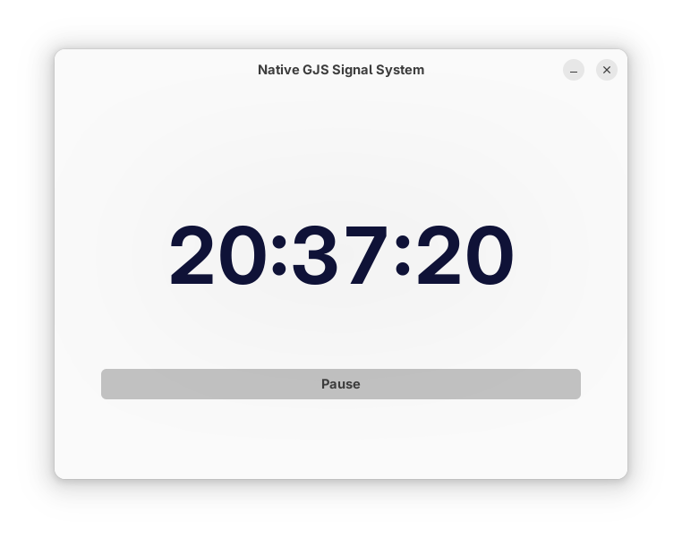

# Model-View Interaction Examples

Three approaches to data binding between model (ClockService) and view (TestWindow) in GJS+GTK applications.

## Custom GObject Signals - CustomGObjectSignals.ts

**Architecture**

- Model: GObject class with custom signals
- Binding: Manual connection via `connect()`/`disconnect()`
- Updates: Through `emit()` of custom signals

### Model (ClockService)

~~~typescript
@Class({ GTypeName: 'ClockService' })
class ClockService extends GObject.Object {

    @Property.Boolean(true)
    declare running: boolean;

    @Signals({ // register custom signal
        'tick': {
            param_types: [GObject.TYPE_STRING]
        }
    })
    declare $signals: {
        'tick': (formatted_time: string) => void;
        'notify::running': (pspec: GObject.ParamSpec) => void;
    } & GObject.Object.SignalSignatures;

    // Emit custom signal on updates
    private update_timer() {

        ...

        if (this.running) {
            this.time_interval_source = setInterval(() => {
                this.emit('tick', this.formatter.format(new Date()));
            }, 333);
        }
    }
}
~~~

### View (TestWindow)

~~~typescript
vfunc_realize(): void {
    super.vfunc_realize();

    // Manual connection management
    this.handlers_ids.clock_service_hid =
        this.clock_service.connect('tick', (_, time) => {
            this.time_label.set_label(time);
        });

    this.handlers_ids.pause_button_hid =
        this.pause_button.connect('toggled', () => {
            this.clock_service.running = this.pause_button.get_active();
        });
}

vfunc_unrealize(): void {
    // Mandatory cleanup
    this.clock_service.disconnect(this.handlers_ids.clock_service_hid);
    this.pause_button.disconnect(this.handlers_ids.pause_button_hid);
    super.vfunc_unrealize();
}
~~~

**Pros**

- Full control over signals
- Typed emit/connect methods
- GObject system integration

**Cons**

- Lots of boilerplate code
- Manual connection lifecycle management
- Imperative style

## Data Binding via Template - CustomGObjectDeclarative.ts

**Architecture**

- Model: GObject class with property notifications only
- Binding: Declarative through template bindings
- Updates: Automatic through property changes

### Model (ClockService)

~~~typescript
@Class({ GTypeName: 'ClockService' })
class ClockService extends GObject.Object {

    // Readonly G-property with JS getter/setter
    @Property.String({ flags: GObject.ParamFlags.READABLE })
    public get current_time(): string { return this._current_time; }
    private set current_time(time: string) {
        this._current_time = time;
        this.notify('current-time'); // Notify about change
    }
    private _current_time = '';

    // Full G-property with automatic notify
    @Property.Boolean(true)
    public get running(): boolean { return this.internal_running; }
    public set running(value: boolean) { 
        this.internal_running = value; 
        this.update_timer(); 
    }
    declare internal_running: boolean;

    // Only notify signals, no custom ones
    declare $signals: {
        'notify::running': (pspec: GObject.ParamSpec) => void;
        'notify::current-time': (pspec: GObject.ParamSpec) => void;
    } & GObject.Object.SignalSignatures;
}
~~~

### View (Template)

~~~xml
<!-- Model created in template -->
<object class="ClockService" id="clock_service">
    <property name="running" 
              bind-source="pause_button" 
              bind-property="active" 
              bind-flags="sync-create|bidirectional" />
</object>

<!-- Declarative binding -->
<object class="GtkLabel" id="time_label">
    <property name="label" 
              bind-source="clock_service" 
              bind-property="current-time" 
              bind-flags="sync-create" />
</object>

<object class="GtkToggleButton" id="pause_button">
    <property name="active">true</property>
    <!-- Dynamic label via closure -->
    <binding name="label">
        <closure type="gchararray" function="get_pause_label_closure">
            <lookup name="running">clock_service</lookup>
        </closure>
    </binding>
</object>
~~~

### View (Code)

~~~typescript
class TestWindow extends Adw.ApplicationWindow {

    @Template.Child
    @Property.Object(ClockService.$gtype) // For inspect in Inspector
    declare clock_service: ClockService;

    // Closure function for dynamic content
    protected get_pause_label_closure(_sender: typeof this, running: boolean): string {
        return running ? 'Pause' : 'Resume';
    }
}
~~~

**Pros**

- Declarative binding style
- Automatic lifecycle management
- Minimal code in classes

**Cons**

- GTK Builder syntax limitations
- Complex logic handling difficulties
- Less control over the process

## Native GJS Signal System - NativeGJSSignalSystem.ts

**Architecture**

- Model: Plain JS class with added signal system
- Binding: Manual through typed methods
- Updates: Through `emit()` with propagation control

### Model (ClockService)

~~~typescript
interface SignalsInterface {
    'tick': (formatted_time: string) => boolean;
}

@AddSignalMethods
class ClockService {
    // Typed signal methods
    declare emit: SignalMethods<SignalsInterface>['emit'];
    declare connect: SignalMethods<SignalsInterface>['connect'];
    declare disconnect: SignalMethods<SignalsInterface>['disconnect'];

    private _running: boolean = false;

    public get running(): boolean { return this._running; }
    public set running(val: boolean) {
        this._running = val;
        this.update_timer();
    }

    private update_timer() {

        ...
        
        if (this.running) {
            this.time_interval_source = setInterval(() => {
                this.emit('tick', this.formatter.format(new Date()));
            }, 333);
        }
    }
}
~~~

### View (TestWindow)

~~~typescript
class TestWindow extends Adw.ApplicationWindow {
    private clock_service = new ClockService();

    vfunc_realize(): void {
        super.vfunc_realize();

        // Signal propagation control
        this.handlers_ids.clock_service_hid =
            this.clock_service.connect('tick', (_, time) => {
                this.time_label.set_label(time);
                return SignalPropagate.STOP; // Stop propagation
            });

        this.handlers_ids.pause_button_hid =
            this.pause_button.connect('toggled', (sender) => {
                this.clock_service.running = sender.get_active();
                sender.set_label(
                    this.clock_service.running ? 'Pause' : 'Resume'
                );
            });
    }
}
~~~

**Pros**

- Not tied to GObject system
- Full signal typing
- Propagation control (`SignalPropagate`)
- Suitable for business logic

**Cons**

- Manual connection management
- No automatic property bindings

## Choosing an Approach

Custom GObject Signals - when you need full GObject system integration and complex signal logic.

Data Binding via Template - for simple cases with declarative data binding and minimal code.

Native GJS Signal System - for business logic and service classes that don't require GObject functionality.